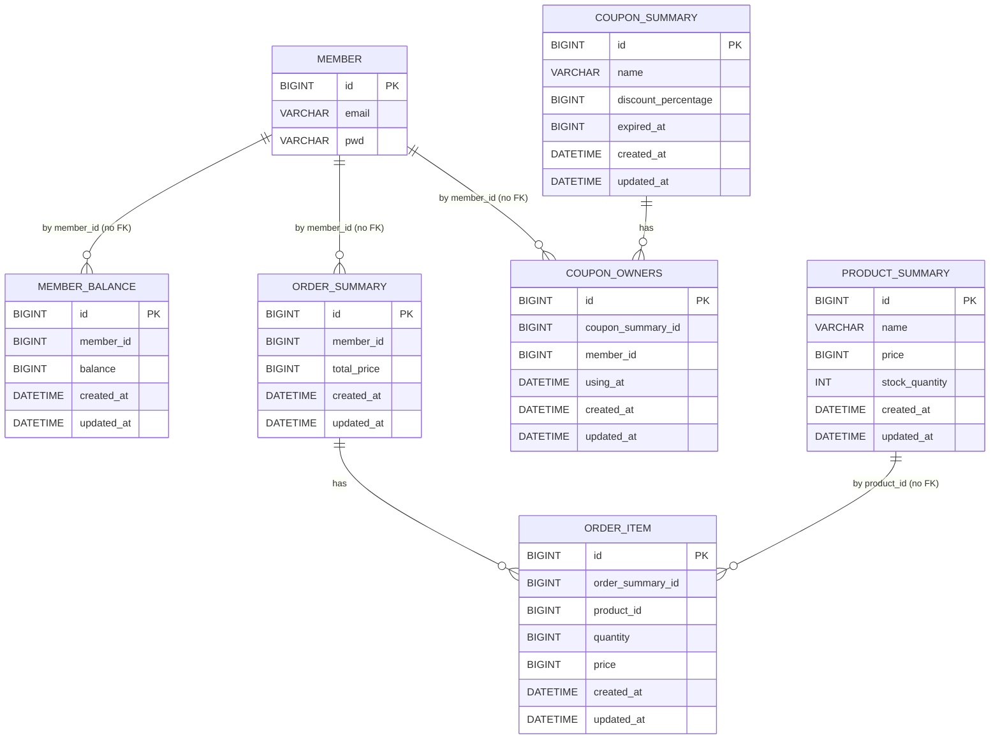

# 데이터베이스 ERD 문서
작성자: [hayden]

## 시각화 (Mermaid)

- 핵심 관계
    - member 1:N member_balance (논리 FK: member_balance.member_id, 현재 외래키 제약 없음)
    - member 1:N order_summary (논리 FK: order_summary.member_id, 현재 외래키 제약 없음)
    - member 1:N coupon_owners (논리 FK: coupon_owners.member_id, 현재 외래키 제약 없음)
    - coupon_summary 1:N coupon_owners (논리 FK: coupon_owners.coupon_summary_id, 현재 외래키 제약 없음)
    - order_summary 1:N order_item (논리 FK: order_item.order_summary_id, 현재 외래키 제약 없음)
    - product_summary → order_item (논리적 참조: order_item.product_id, 현재 외래키 제약 없음)

---

## 테이블 상세

### 0) member
- 컬럼

| 컬럼 | 타입 | 제약/설명 |
|---|---|---|
| id | BIGINT | PK, AUTO_INCREMENT |
| email | VARCHAR(255) | NOT NULL |
| pwd | VARCHAR(255) | NOT NULL |

- 인덱스
  - UNIQUE idx_member_email(email)
- 관계
  - 1:N member_balance.member_id (FK 없음)
  - 1:N order_summary.member_id (FK 없음)
  - 1:N coupon_owners.member_id (FK 없음)

### 1) member_balance
- 컬럼

| 컬럼 | 타입 | 제약/설명 |
|---|---|---|
| id | BIGINT | PK, AUTO_INCREMENT |
| member_id | BIGINT | NOT NULL, 회원별 1행 가정 |
| balance | BIGINT | NOT NULL, DEFAULT 0 |
| created_at | DATETIME(6) | NOT NULL |
| updated_at | DATETIME(6) | NOT NULL |

- 인덱스
  - UNIQUE idx_member_balance_member_id(member_id)
- 관계
  - N:1 member (FK 없음)

### 2) product_summary
- 컬럼

| 컬럼 | 타입 | 제약/설명 |
|---|---|---|
| id | BIGINT | PK, AUTO_INCREMENT |
| name | VARCHAR(255) | NOT NULL |
| price | BIGINT | NOT NULL |
| stock_quantity | INT | NOT NULL |
| created_at | DATETIME(6) | NOT NULL |
| updated_at | DATETIME(6) | NOT NULL |

- 인덱스
  - idx_product_summary_name(name)
- 관계
  - order_item.product_id가 논리적으로 참조 (FK 없음)

### 3) coupon_summary
- 컬럼

| 컬럼 | 타입 | 제약/설명 |
|---|---|---|
| id | BIGINT | PK, AUTO_INCREMENT |
| name | VARCHAR(255) | NOT NULL |
| discount_percentage | BIGINT | NOT NULL |
| expired_at | BIGINT | NOT NULL |
| created_at | DATETIME(6) | NOT NULL |
| updated_at | DATETIME(6) | NOT NULL |

- 인덱스
  - idx_coupon_summary_expired_at(expired_at)
- 관계
  - 1:N coupon_owners.coupon_summary_id (FK 없음)

### 4) coupon_owners
- 컬럼

| 컬럼 | 타입 | 제약/설명 |
|---|---|---|
| id | BIGINT | PK, AUTO_INCREMENT |
| coupon_summary_id | BIGINT | NOT NULL |
| member_id | BIGINT | NOT NULL |
| using_at | DATETIME(6) | NULL |
| created_at | DATETIME(6) | NOT NULL |
| updated_at | DATETIME(6) | NOT NULL |

- 인덱스
  - idx_coupon_owners_member_id(member_id)
- 관계
  - N:1 coupon_summary (FK 없음)
  - N:1 member (FK 없음)

### 5) order_summary
- 컬럼

| 컬럼 | 타입 | 제약/설명 |
|---|---|---|
| id | BIGINT | PK, AUTO_INCREMENT |
| member_id | BIGINT | NOT NULL |
| total_price | BIGINT | NOT NULL |
| created_at | DATETIME(6) | NOT NULL |
| updated_at | DATETIME(6) | NOT NULL |

- 인덱스
  - idx_order_summary_member_id(member_id)
- 관계
  - N:1 member (FK 없음)
  - 1:N order_item.order_summary_id (FK 없음)

### 6) order_item
- 컬럼

| 컬럼 | 타입 | 제약/설명 |
|---|---|---|
| id | BIGINT | PK, AUTO_INCREMENT |
| order_summary_id | BIGINT | NOT NULL |
| product_id | BIGINT | NOT NULL |
| quantity | BIGINT | NOT NULL |
| price | BIGINT | NOT NULL |
| created_at | DATETIME(6) | NOT NULL |
| updated_at | DATETIME(6) | NOT NULL |

- 인덱스
  - idx_order_item_order_summary_id(order_summary_id)
  - idx_order_item_product_id(created_at, product_id) — 상품별/기간별 조회 통계용
- 관계
  - N:1 order_summary (FK 없음)
  - product_summary에 대한 논리적 참조 (FK 없음)