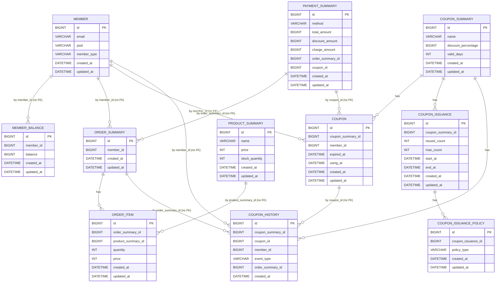

# 데이터베이스 ERD 문서
작성자: [hayden]

## 시각화 (Mermaid)

- 핵심 관계
    - member 1:1 member_balance (논리 FK: member_balance.member_id, 현재 외래키 제약 없음)
    - member 1:N order_summary (논리 FK: order_summary.member_id, 현재 외래키 제약 없음)
    - member 1:N coupon (논리 FK: coupon.member_id, 현재 외래키 제약 없음)
    - member 1:N coupon_history (논리 FK: coupon_history.member_id, 현재 외래키 제약 없음)
    - coupon_summary 1:N coupon (논리 FK: coupon.coupon_summary_id, 현재 외래키 제약 없음)
    - coupon_summary 1:N coupon_issuance (논리 FK: coupon_issuance.coupon_summary_id, 현재 외래키 제약 없음)
    - coupon_summary 1:N coupon_history (논리 FK: coupon_history.coupon_summary_id, 현재 외래키 제약 없음)
    - coupon 1:N coupon_history (논리 FK: coupon_history.coupon_id, 현재 외래키 제약 없음)
    - coupon_issuance 1:N coupon_issuance_policy (논리 FK: coupon_issuance_policy.coupon_issuance_id, 현재 외래키 제약 없음)
    - order_summary 1:N order_item (논리 FK: order_item.order_summary_id, 현재 외래키 제약 없음)
    - order_summary → coupon_history (논리적 참조: coupon_history.order_summary_id, 현재 외래키 제약 없음)
    - product_summary 1:N order_item (논리 FK: order_item.product_summary_id, 현재 외래키 제약 없음)
    - payment_summary N:1 order_summary (order_summary_id, FK 없음)
    - payment_summary N:1 coupon (coupon_id, FK 없음)

---

## 테이블 상세

### 0) member
- 컬럼

| 컬럼 | 타입 | 제약/설명 |
|---|---|---|
| id | BIGINT | PK, AUTO_INCREMENT |
| email | VARCHAR(255) | NOT NULL, UNIQUE |
| pwd | VARCHAR(255) | NOT NULL |
| member_type | VARCHAR(50) | NOT NULL, DEFAULT 'GENERAL' |
| created_at | DATETIME(6) | NOT NULL |
| updated_at | DATETIME(6) | NOT NULL |

- 인덱스
  - UNIQUE idx_member_email(email)
- 관계
  - 1:N member_balance.member_id (FK 없음)
  - 1:N order_summary.member_id (FK 없음)
  - 1:N coupon.member_id (FK 없음)

### 1) member_balance
- 컬럼

| 컬럼 | 타입 | 제약/설명 |
|---|---|---|
| id | BIGINT | PK, AUTO_INCREMENT |
| member_id | BIGINT | NOT NULL, 회원별 1행 가정 |
| balance | BIGINT | NOT NULL, DEFAULT 0 |
| created_at | DATETIME(6) | NOT NULL |
| updated_at | DATETIME(6) | NOT NULL |

- 인덱스
  - UNIQUE idx_member_balance_member_id(member_id)
- 관계
  - N:1 member (FK 없음)

### 2) product_summary
- 컬럼

| 컬럼 | 타입 | 제약/설명 |
|---|---|---|
| id | BIGINT | PK, AUTO_INCREMENT |
| name | VARCHAR(255) | NOT NULL |
| price | INT | NOT NULL |
| stock_quantity | INT | NOT NULL |
| created_at | DATETIME(6) | NOT NULL |
| updated_at | DATETIME(6) | NOT NULL |

- 인덱스
  - idx_product_summary_name(name)
- 관계
  - order_item.product_summary_id가 논리적으로 참조 (FK 없음)

### 3) coupon_summary
- 컬럼

| 컬럼 | 타입 | 제약/설명 |
|---|---|---|
| id | BIGINT | PK, AUTO_INCREMENT |
| name | VARCHAR(255) | NOT NULL |
| discount_percentage | BIGINT | NOT NULL |
| valid_days | INT | NULL, 발급 후 유효기간(일) |
| created_at | DATETIME(6) | NOT NULL |
| updated_at | DATETIME(6) | NOT NULL |

- 관계
  - 1:N coupon.coupon_summary_id (FK 없음)
  - 1:N coupon_issuance.coupon_summary_id (FK 없음)
  - 1:N coupon_history.coupon_summary_id (FK 없음)

### 4) coupon
- 컬럼

| 컬럼 | 타입 | 제약/설명 |
|---|---|---|
| id | BIGINT | PK, AUTO_INCREMENT |
| coupon_summary_id | BIGINT | NOT NULL |
| member_id | BIGINT | NOT NULL |
| expired_at | DATETIME(6) | NULL |
| using_at | DATETIME(6) | NULL |
| created_at | DATETIME(6) | NOT NULL |
| updated_at | DATETIME(6) | NOT NULL |

- 인덱스
  - idx_coupon_member_id(member_id)
  - idx_coupon_coupon_summary_id(coupon_summary_id)
- 관계
  - N:1 coupon_summary (FK 없음)
  - N:1 member (FK 없음)
  - 1:N coupon_history.coupon_id (FK 없음)

### 5) coupon_issuance
- 컬럼

| 컬럼 | 타입 | 제약/설명 |
|---|---|---|
| id | BIGINT | PK, AUTO_INCREMENT |
| coupon_summary_id | BIGINT | NOT NULL |
| issued_count | INT | NOT NULL |
| max_count | INT | NULL, 최대 발급 수 (NULL이면 무제한) |
| start_at | DATETIME(6) | NOT NULL |
| end_at | DATETIME(6) | NOT NULL |
| created_at | DATETIME(6) | NOT NULL |
| updated_at | DATETIME(6) | NOT NULL |

- 인덱스
  - idx_coupon_issuance_coupon_summary_id(coupon_summary_id)
  - idx_coupon_issuance_period(start_at, end_at)
- 관계
  - N:1 coupon_summary (FK 없음)
  - 1:N coupon_issuance_policy.coupon_issuance_id (FK 없음)

### 6) coupon_issuance_policy
- 컬럼

| 컬럼 | 타입 | 제약/설명 |
|---|---|---|
| id | BIGINT | PK, AUTO_INCREMENT |
| coupon_issuance_id | BIGINT | NOT NULL |
| policy_type | VARCHAR(50) | NOT NULL, 정책 유형(ONE_PER_MEMBER 등) |
| created_at | DATETIME(6) | NOT NULL |
| updated_at | DATETIME(6) | NOT NULL |

- 인덱스
  - idx_coupon_issuance_policy_coupon_issuance_id(coupon_issuance_id)
- 관계
  - N:1 coupon_issuance (FK 없음)

### 7) coupon_history
- 컬럼

| 컬럼 | 타입 | 제약/설명 |
|---|---|---|
| id | BIGINT | PK, AUTO_INCREMENT |
| coupon_summary_id | BIGINT | NOT NULL |
| coupon_id | BIGINT | NULL |
| member_id | BIGINT | NOT NULL |
| event_type | VARCHAR(20) | NOT NULL, ISSUED/USED/CANCELLED/EXPIRED |
| order_summary_id | BIGINT | NULL, 사용/취소 시 주문 ID |
| created_at | DATETIME(6) | NOT NULL |

- 인덱스
  - idx_coupon_history_coupon_summary_id(coupon_summary_id)
  - idx_coupon_history_member_id(member_id)
  - idx_coupon_history_event_type(event_type, created_at)
  - idx_coupon_history_coupon_id(coupon_id)
- 관계
  - N:1 coupon_summary (FK 없음)
  - N:1 coupon (FK 없음)
  - N:1 member (FK 없음)
  - order_summary에 대한 논리적 참조 (FK 없음)

### 8) order_summary
- 컬럼

| 컬럼 | 타입 | 제약/설명 |
|---|---|---|
| id | BIGINT | PK, AUTO_INCREMENT |
| member_id | BIGINT | NOT NULL |
| created_at | DATETIME(6) | NOT NULL |
| updated_at | DATETIME(6) | NOT NULL |

- 인덱스
  - idx_order_summary_member_id(member_id)
- 관계
  - N:1 member (FK 없음)
  - 1:N order_item.order_summary_id (FK 없음)

### 9) order_item
- 컬럼

| 컬럼 | 타입 | 제약/설명 |
|---|---|---|
| id | BIGINT | PK, AUTO_INCREMENT |
| order_summary_id | BIGINT | NOT NULL |
| product_summary_id | BIGINT | NOT NULL |
| quantity | INT | NOT NULL |
| price | INT | NOT NULL |
| created_at | DATETIME(6) | NOT NULL |
| updated_at | DATETIME(6) | NOT NULL |

- 인덱스
  - idx_order_item_order_summary_id(order_summary_id)
  - idx_order_item_product_summary_id(created_at, product_summary_id)
- 관계
  - N:1 order_summary (FK 없음)
  - N:1 product_summary (FK 없음)

### 10) payment_summary
- 컬럼

| 컬럼 | 타입 | 제약/설명 |
|---|---|---|
| id | BIGINT | PK, AUTO_INCREMENT |
| method | VARCHAR(50) | NOT NULL |
| total_amount | BIGINT | NOT NULL |
| discount_amount | BIGINT | NOT NULL |
| charge_amount | BIGINT | NOT NULL |
| order_summary_id | BIGINT | NOT NULL |
| coupon_id | BIGINT | NULL |
| created_at | DATETIME(6) | NOT NULL |
| updated_at | DATETIME(6) | NOT NULL |

- 인덱스
  - idx_payment_summary_order_summary_id(order_summary_id)
  - idx_payment_summary_coupon_id(coupon_id)
- 관계
  - N:1 member (FK 없음)
  - N:1 order_summary (FK 없음)
  - N:1 coupon (FK 없음)
