# Kafka 기초 개념

> 이 문서는 Kafka를 처음 접하는 동료들을 위해 작성되었습니다.
> Kafka의 기본 개념부터 장단점, 주요 특징까지 전반적인 내용을 다룹니다.

---

## 1. Kafka란?

Apache Kafka는 LinkedIn에서 개발하고 Apache Software Foundation에 기부된 **분산 이벤트 스트리밍 플랫폼**입니다.

간단히 말해, **대용량의 데이터를 실시간으로 수집하고 전달하는 메시지 시스템**입니다.

### 왜 Kafka가 필요할까?

기존의 시스템에서는 서비스 간 통신이 필요할 때 직접 API를 호출하는 방식을 사용합니다.

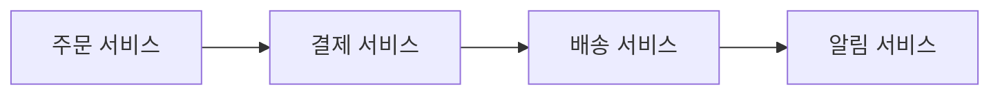
```mermaid
flowchart LR
    A[주문 서비스] --> B[결제 서비스]
    B --> C[배송 서비스]
    C --> D[알림 서비스]
```

이런 구조에서는:
- 한 서비스가 장애를 일으키면 전체 흐름이 멈춤
- 서비스가 늘어날수록 복잡도가 기하급수적으로 증가
- 트래픽이 몰리면 병목 현상 발생

Kafka를 사용하면:

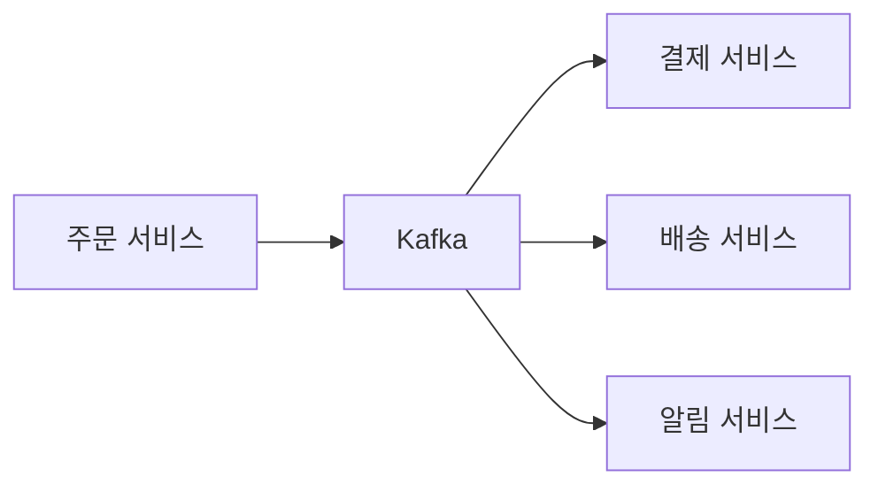
```mermaid
flowchart LR
    A[주문 서비스] --> K[Kafka]
    K --> B[결제 서비스]
    K --> C[배송 서비스]
    K --> D[알림 서비스]
```

서비스들이 **느슨하게 결합(Loosely Coupled)**되어 독립적으로 동작할 수 있습니다.

---

## 2. 이벤트 기반 아키텍처로의 확장

### 시스템 전체 관점으로의 확장

Kafka를 통해 이벤트를 시스템 전체 관점으로 확장하면 다음과 같은 장점을 얻을 수 있습니다:

- **단일 진실 공급원(Single Source of Truth)**: 모든 서비스가 동일한 이벤트 스트림을 바라보므로 데이터 일관성 확보
- **서비스 독립성**: 새로운 서비스 추가 시 기존 서비스 수정 없이 이벤트 구독만으로 연동 가능
- **시간 여행(Time Travel)**: 과거 이벤트를 재생하여 새 서비스의 상태를 구축하거나 버그 재현 가능
- **감사 추적(Audit Trail)**: 모든 비즈니스 활동이 이벤트로 기록되어 추적 및 디버깅 용이

개별 서비스에서 발생하는 이벤트를 **시스템 전체가 공유**할 수 있습니다.

| 이벤트 | 관심 있는 서비스 |
|--------|------------------|
| 주문 생성 | 결제, 재고, 알림, 분석 |
| 결제 완료 | 배송, 알림, 정산 |
| 배송 시작 | 알림, 추적 |
| 상품 조회 | 추천, 분석, 검색 |

이처럼 **하나의 이벤트가 여러 서비스에서 활용**될 수 있으며, 이를 통해 다양한 아키텍처 패턴을 적용할 수 있습니다:

### 실시간 데이터 파이프라인

여러 소스에서 발생하는 데이터를 실시간으로 수집, 변환, 적재하는 파이프라인을 구축할 수 있습니다.

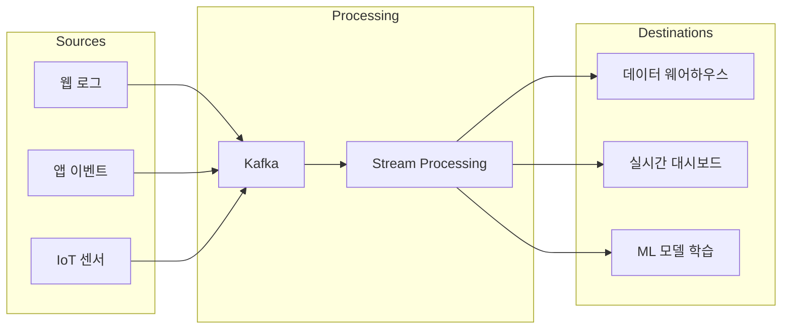
```mermaid
flowchart LR
    subgraph Sources
        A[웹 로그]
        B[앱 이벤트]
        C[IoT 센서]
    end

    subgraph Processing
        K[Kafka]
        S[Stream Processing]
    end

    subgraph Destinations
        D[데이터 웨어하우스]
        E[실시간 대시보드]
        F[ML 모델 학습]
    end

    A --> K
    B --> K
    C --> K
    K --> S
    S --> D
    S --> E
    S --> F
```

**장점**:
- ETL 배치 처리 대비 데이터 지연 시간 대폭 감소 (분 단위 → 초 단위)
- 데이터 소스 추가/변경 시 파이프라인 전체 수정 불필요
- Kafka Streams, Flink 등과 연계하여 실시간 집계/변환 처리

### 이벤트 소싱 (Event Sourcing)

현재 상태만 저장하는 대신, **상태 변화를 일으킨 모든 이벤트를 순차적으로 저장**하는 패턴입니다.

```
# 기존 방식: 현재 상태만 저장
Account { id: 1, balance: 15000 }

# 이벤트 소싱: 모든 이벤트 저장
Event 1: AccountCreated { id: 1, initialBalance: 0 }
Event 2: MoneyDeposited { id: 1, amount: 20000 }
Event 3: MoneyWithdrawn { id: 1, amount: 5000 }
→ 현재 상태: balance = 0 + 20000 - 5000 = 15000
```

**장점**:
- **완전한 이력 추적**: "왜 이 상태가 되었는가?"에 대한 답을 항상 찾을 수 있음
- **버그 재현 및 디버깅**: 문제 발생 시점의 이벤트를 재생하여 정확한 상황 재현
- **비즈니스 인사이트**: 사용자 행동 패턴, 취소율 등 이벤트 기반 분석 가능
- **상태 재구성**: 이벤트를 처음부터 재생하여 언제든 상태 복구 가능

### CQRS (Command Query Responsibility Segregation)

**쓰기(Command)**와 **읽기(Query)** 모델을 분리하는 패턴입니다.

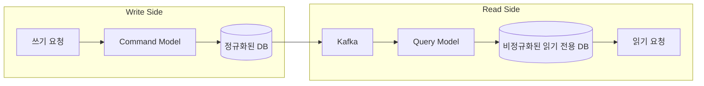
```mermaid
flowchart LR
    subgraph Write Side
        W[쓰기 요청] --> C[Command Model]
        C --> DB1[(정규화된 DB)]
    end

    DB1 --> K[Kafka]

    subgraph Read Side
        K --> Q[Query Model]
        Q --> DB2[(비정규화된 읽기 전용 DB)]
        DB2 --> R[읽기 요청]
    end
```

**장점**:
- **읽기 성능 최적화**: 조회에 최적화된 비정규화 모델 사용 (복잡한 JOIN 제거)
- **독립적 확장**: 읽기/쓰기 부하에 따라 각각 독립적으로 스케일링
- **다양한 뷰 제공**: 동일 데이터를 목적에 맞는 여러 형태로 제공 (검색용, 리포트용, API용)
- **기술 스택 분리**: 쓰기는 RDB, 읽기는 Elasticsearch/Redis 등 목적에 맞는 저장소 선택

---

## 3. Kafka의 장단점

### 주요 메시지 큐 서비스 비교

Kafka 외에도 RabbitMQ, AWS SQS, Redis Pub/Sub 등 다양한 메시지 큐 서비스가 있습니다. 각각의 특성을 비교해봅시다.

| 특성 | Kafka | RabbitMQ | AWS SQS | Redis Pub/Sub |
|------|-------|----------|---------|---------------|
| **처리량** | **초당 수백만 건** | 초당 수만 건 | 초당 수천 건 | 초당 수십만 건 |
| **메시지 보존** | **설정 기간 동안 보존** | 소비 후 삭제 | 최대 14일 | 보존 안 함 |
| **메시지 재처리** | **offset으로 가능** | 불가 (DLQ 활용) | 불가 | 불가 |
| **순서 보장** | 파티션 내 보장 | 큐 내 보장 | FIFO 큐만 보장 | 보장 안 함 |
| **라우팅** | 단순 (Topic 기반) | 복잡한 라우팅 지원 | 단순 | 채널 기반 |
| **프로토콜** | 자체 프로토콜 | AMQP, MQTT, STOMP | HTTP/HTTPS | Redis 프로토콜 |
| **운영 복잡도** | 높음 | 중간 | 낮음 (관리형) | 낮음 |
| **지연 시간** | 밀리초 | 마이크로초 | 밀리초~초 | 마이크로초 |

### 장점 (타 서비스 대비)

| 장점 | 설명 | vs RabbitMQ | vs SQS |
|------|------|-------------|--------|
| **높은 처리량** | 초당 수백만 건 처리 | RabbitMQ 대비 10~100배 처리량 | SQS 대비 훨씬 높은 처리량 |
| **확장성** | 파티션 추가로 수평 확장 | 클러스터 확장이 더 용이 | 자동 확장되나 처리량 제한 있음 |
| **내구성** | 디스크 저장 + 복제 | 유사 (둘 다 영속성 지원) | AWS 관리형으로 내구성 보장 |
| **메시지 재처리** | offset 조정으로 가능 | 기본적으로 불가능 | 불가능 |
| **Consumer 독립성** | Consumer Group별 독립 소비 | Exchange 설정 필요 | 별도 큐 필요 |
| **장기 보존** | 설정에 따라 무제한 보존 | 소비 후 삭제가 기본 | 최대 14일 |
| **스트림 처리** | Kafka Streams 내장 | 별도 도구 필요 | Lambda 연동 필요 |

### 단점 (타 서비스 대비)

| 단점 | 설명 | vs RabbitMQ | vs SQS |
|------|------|-------------|--------|
| **운영 복잡도** | 브로커, ZK/KRaft 관리 | RabbitMQ가 상대적으로 단순 | SQS는 완전 관리형 |
| **학습 곡선** | 파티션, 오프셋 개념 학습 | RabbitMQ가 더 직관적 | SQS가 가장 단순 |
| **순서 보장 제한** | 파티션 내에서만 보장 | 큐 전체 순서 보장 가능 | FIFO 큐로 완전 보장 |
| **복잡한 라우팅** | Topic 기반 단순 라우팅 | Exchange로 복잡한 라우팅 | SNS 조합으로 가능 |
| **지연 시간** | 밀리초 수준 | 마이크로초 가능 | 밀리초~초 |
| **초기 설정** | 클러스터 구성 필요 | 단일 노드로 시작 가능 | 즉시 사용 가능 |
| **비용** | 인프라 직접 관리 | 인프라 직접 관리 | 요청당 과금 (예측 가능) |

---

## 4. Kafka의 주요 구성 요소

### 핵심 컴포넌트

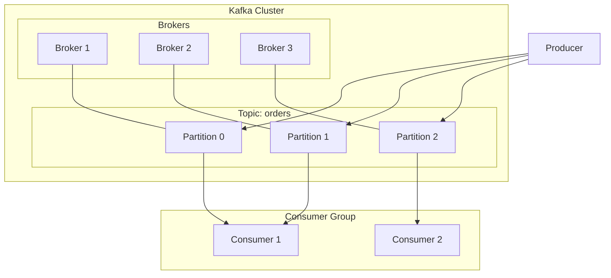
```mermaid
flowchart TB
    subgraph Kafka Cluster
        subgraph Brokers
            B1[Broker 1]
            B2[Broker 2]
            B3[Broker 3]
        end

        subgraph Topic: orders
            P0[Partition 0]
            P1[Partition 1]
            P2[Partition 2]
        end

        B1 --- P0
        B2 --- P1
        B3 --- P2
    end

    P[Producer] --> P0
    P --> P1
    P --> P2

    subgraph Consumer Group
        C1[Consumer 1]
        C2[Consumer 2]
    end

    P0 --> C1
    P1 --> C1
    P2 --> C2
```

### 구성 요소 설명

| 구성 요소 | 설명 |
|-----------|------|
| **Broker** | Kafka 서버 인스턴스. 메시지를 저장하고 전달하는 역할 |
| **Cluster** | 여러 Broker로 구성된 Kafka 시스템 |
| **Topic** | 메시지를 구분하는 논리적 채널 (예: orders, payments) |
| **Partition** | Topic을 물리적으로 분할한 단위. 병렬 처리의 기본 단위 |
| **Producer** | 메시지를 생성하여 Topic에 전송하는 클라이언트 |
| **Consumer** | Topic에서 메시지를 읽어가는 클라이언트 |
| **Consumer Group** | 여러 Consumer를 묶어 파티션을 분배받는 그룹 |
| **Offset** | 파티션 내 메시지의 고유 순번. Consumer의 읽기 위치 추적에 사용 |
| **Replica** | 파티션의 복제본. Leader와 Follower로 구분 |

### Topic, Broker, Partition의 관계

Kafka를 처음 접할 때 가장 헷갈리는 부분이 Topic, Broker, Partition의 관계입니다. 이들의 관계를 명확히 이해해봅시다.

#### 개념 비유

| Kafka 개념 | 비유 | 설명 |
|------------|------|------|
| **Topic** | 게시판 | "주문 게시판", "결제 게시판"처럼 메시지를 주제별로 분류하는 논리적 단위 |
| **Partition** | 게시판의 페이지 | 하나의 게시판을 여러 페이지로 나눠 동시에 여러 사람이 글을 쓸 수 있게 함 |
| **Broker** | 서버 컴퓨터 | 실제로 데이터를 저장하는 물리적 서버 |

#### 관계도

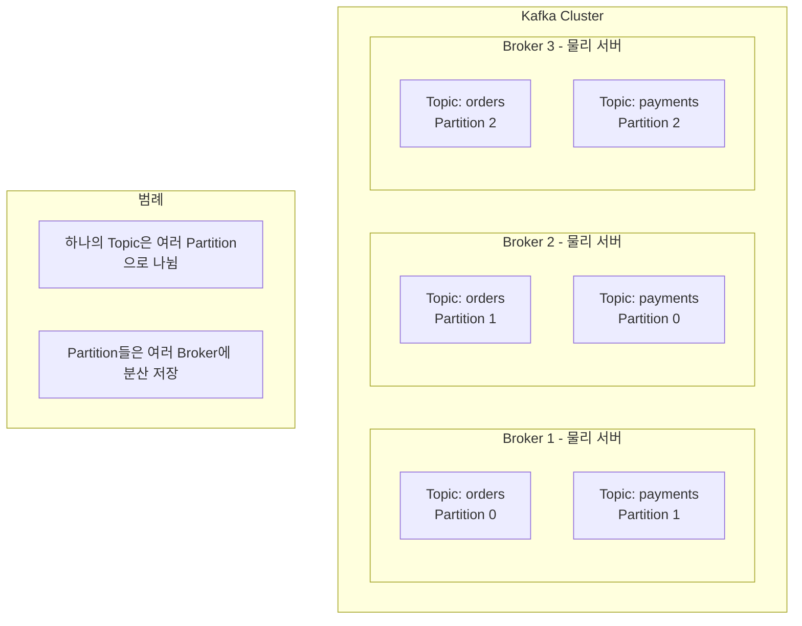
```mermaid
flowchart TB
    subgraph Cluster[Kafka Cluster]
        subgraph B1[Broker 1 - 물리 서버]
            T1P0[Topic: orders<br/>Partition 0]
            T2P1[Topic: payments<br/>Partition 1]
        end

        subgraph B2[Broker 2 - 물리 서버]
            T1P1[Topic: orders<br/>Partition 1]
            T2P0[Topic: payments<br/>Partition 0]
        end

        subgraph B3[Broker 3 - 물리 서버]
            T1P2[Topic: orders<br/>Partition 2]
            T2P2[Topic: payments<br/>Partition 2]
        end
    end

    subgraph Legend[범례]
        L1[하나의 Topic은 여러 Partition으로 나뉨]
        L2[Partition들은 여러 Broker에 분산 저장]
    end
```

#### 핵심 포인트

**1. Topic은 논리적 개념, Partition은 물리적 개념**

```
Topic: orders (논리적 - "주문 데이터를 담는 곳")
  ├── Partition 0 (물리적 - 실제 파일로 존재)
  ├── Partition 1 (물리적 - 실제 파일로 존재)
  └── Partition 2 (물리적 - 실제 파일로 존재)
```

- Topic은 메시지를 분류하는 **이름표** 같은 개념
- Partition은 실제 디스크에 저장되는 **파일**

**2. Partition은 여러 Broker에 분산됨**

```
Broker 1: orders-P0, payments-P1
Broker 2: orders-P1, payments-P0
Broker 3: orders-P2, payments-P2
```

- 하나의 Topic이 여러 Broker에 걸쳐 저장됨
- 이를 통해 **부하 분산**과 **고가용성** 확보

**3. 하나의 Broker는 여러 Topic의 여러 Partition을 가질 수 있음**

```
Broker 1이 가진 Partition들:
  - orders 토픽의 Partition 0
  - orders 토픽의 Partition 3
  - payments 토픽의 Partition 1
  - users 토픽의 Partition 0, 2
```

#### Producer와 Consumer의 연결

**Producer → Topic → Partition**

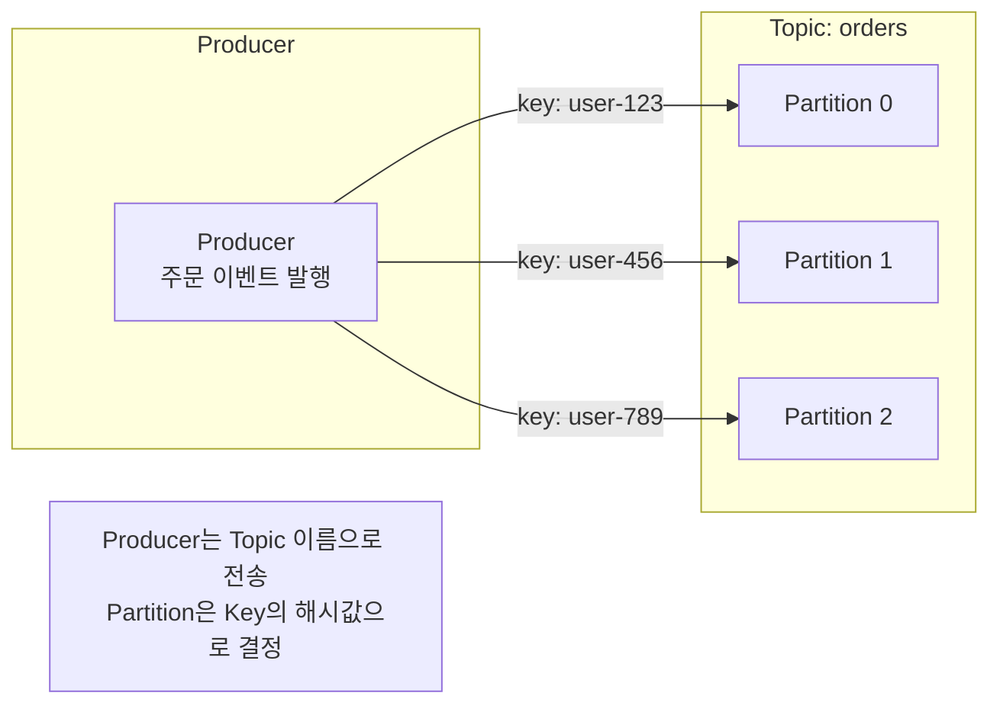
```mermaid
flowchart LR
    subgraph Producer
        P[Producer<br/>주문 이벤트 발행]
    end

    subgraph Topic: orders
        P0[Partition 0]
        P1[Partition 1]
        P2[Partition 2]
    end

    P -->|key: user-123| P0
    P -->|key: user-456| P1
    P -->|key: user-789| P2

    Note1[Producer는 Topic 이름으로 전송<br/>Partition은 Key의 해시값으로 결정]
```

- Producer는 **Topic 이름**을 지정하여 메시지 전송
- **어떤 Partition에 저장될지는 Key로 결정** (같은 Key → 같은 Partition)
- Key가 없으면 Round-Robin으로 분배

**Consumer ← Partition**

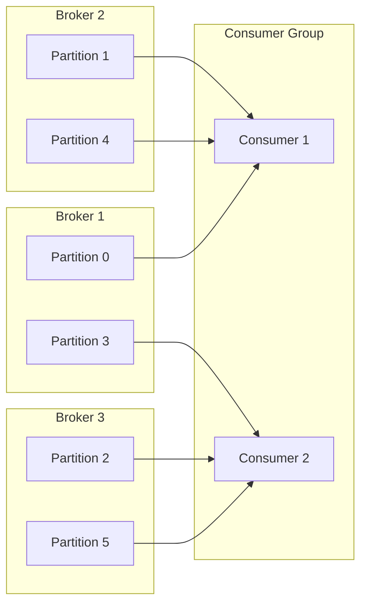
```mermaid
flowchart LR
    subgraph Broker 1
        P0[Partition 0]
        P3[Partition 3]
    end

    subgraph Broker 2
        P1[Partition 1]
        P4[Partition 4]
    end

    subgraph Broker 3
        P2[Partition 2]
        P5[Partition 5]
    end

    subgraph Consumer Group
        C1[Consumer 1]
        C2[Consumer 2]
    end

    P0 --> C1
    P1 --> C1
    P2 --> C2
    P3 --> C2
    P4 --> C1
    P5 --> C2
```

- Consumer는 **Broker 위치와 상관없이 Partition 단위**로 메시지를 읽음
- 위 그림에서 Consumer 1은 Broker 1의 P0, Broker 2의 P1, P4를 담당 (여러 Broker에 걸침)
- 같은 Consumer Group 내에서 **하나의 Partition은 하나의 Consumer만** 담당
- Consumer 수 > Partition 수이면 놀고 있는 Consumer 발생

#### 왜 이렇게 설계했을까?

| 설계 | 이유 |
|------|------|
| Topic을 Partition으로 분할 | 병렬 처리를 통한 처리량 향상 |
| Partition을 여러 Broker에 분산 | 부하 분산 + 장애 대응 |
| Consumer가 Partition 단위로 소비 | 순서 보장 (Partition 내에서) + 병렬 처리 |
| 같은 Key는 같은 Partition | 관련 메시지의 순서 보장 (예: 같은 주문의 이벤트들) |

### 동작 원리

#### 메시지 발행과 소비 과정

Producer가 메시지를 발행하고 Consumer가 소비하는 전체 과정을 살펴봅시다.

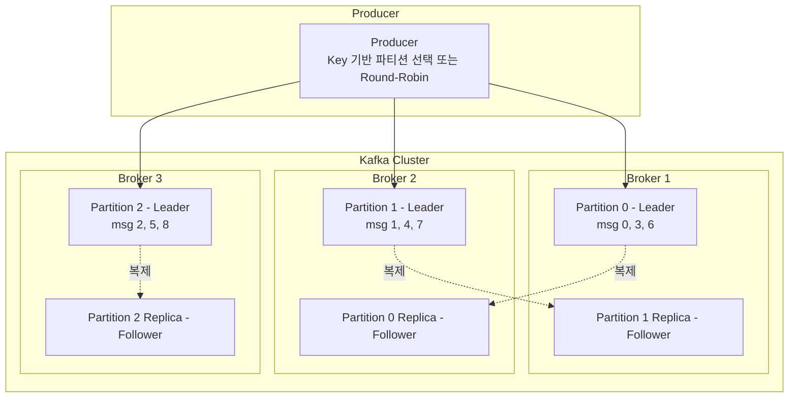
```mermaid
flowchart TB
    subgraph Producer
        PR[Producer<br/>Key 기반 파티션 선택 또는 Round-Robin]
    end

    subgraph Kafka Cluster
        subgraph Broker1[Broker 1]
            P0L[Partition 0 - Leader<br/>msg 0, 3, 6]
            P1F[Partition 1 Replica - Follower]
        end

        subgraph Broker2[Broker 2]
            P1L[Partition 1 - Leader<br/>msg 1, 4, 7]
            P0F[Partition 0 Replica - Follower]
        end

        subgraph Broker3[Broker 3]
            P2L[Partition 2 - Leader<br/>msg 2, 5, 8]
            P2F[Partition 2 Replica - Follower]
        end
    end

    PR --> P0L
    PR --> P1L
    PR --> P2L

    P0L -.->|복제| P0F
    P1L -.->|복제| P1F
    P2L -.->|복제| P2F
```

**1단계: Producer의 메시지 발행**

```
Producer → Broker (Leader Partition)

1. Producer가 메시지 전송 요청
2. 파티션 결정:
   - Key가 있으면: hash(key) % partition_count → 특정 파티션
   - Key가 없으면: Round-Robin 또는 Sticky Partitioner
3. 해당 파티션의 Leader Broker로 메시지 전송
4. Leader가 메시지를 로컬 로그에 기록
5. Follower들이 Leader로부터 메시지 복제
6. ACK 설정에 따라 Producer에게 응답
```

**2단계: 메시지 저장 구조**

```
Partition 0 (Segment Files)
┌─────────────────────────────────────────────────────┐
│  Offset: 0    1    2    3    4    5    6    7      │
│         [m0] [m1] [m2] [m3] [m4] [m5] [m6] [m7]    │
│                                       ↑            │
│                              현재 쓰기 위치          │
└─────────────────────────────────────────────────────┘

- 메시지는 Append-Only 방식으로 순차 기록
- 각 메시지는 고유한 Offset 번호 부여
- Segment 파일 단위로 관리 (기본 1GB 또는 7일)
```

**3단계: Consumer의 메시지 소비**

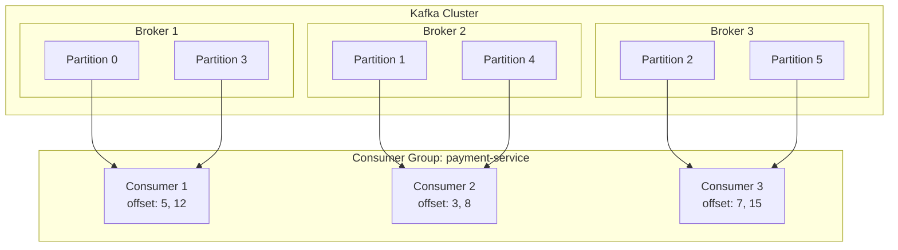
```mermaid
flowchart TB
    subgraph Kafka Cluster
        subgraph Broker 1
            P0[Partition 0]
            P3[Partition 3]
        end
        subgraph Broker 2
            P1[Partition 1]
            P4[Partition 4]
        end
        subgraph Broker 3
            P2[Partition 2]
            P5[Partition 5]
        end
    end

    subgraph Consumer Group: payment-service
        C1[Consumer 1<br/>offset: 5, 12]
        C2[Consumer 2<br/>offset: 3, 8]
        C3[Consumer 3<br/>offset: 7, 15]
    end

    P0 --> C1
    P3 --> C1
    P1 --> C2
    P4 --> C2
    P2 --> C3
    P5 --> C3
```

> **참고**: 하나의 브로커는 여러 파티션을 가질 수 있으며, 하나의 Consumer도 여러 파티션을 담당할 수 있습니다.

**Consumer 소비 과정:**

1. Consumer가 Consumer Group에 참여 (Group Coordinator와 통신)
2. 파티션 할당 (Rebalancing)
3. 각 Consumer는 할당된 파티션에서 메시지 Pull
4. 마지막으로 읽은 Offset을 __consumer_offsets 토픽에 커밋
5. 장애 복구 시 커밋된 Offset부터 재개

#### ACK 옵션에 따른 동작 차이

Producer가 메시지 전송 후 받는 확인 응답(ACK) 설정에 따라 **신뢰성**과 **성능**이 달라집니다.

| acks 설정 | 동작 | 신뢰성 | 성능 | 사용 시나리오 |
|-----------|------|--------|------|---------------|
| **acks=0** | 응답을 기다리지 않음 | 낮음 (유실 가능) | **최고** | 로그, 메트릭 (유실 허용) |
| **acks=1** | Leader 기록 후 응답 | 중간 | 중간 | 일반적인 사용 |
| **acks=all (-1)** | 모든 ISR 복제 후 응답 | **최고** | 낮음 | 금융, 주문 (유실 불가) |

**acks=0 (Fire and Forget)**

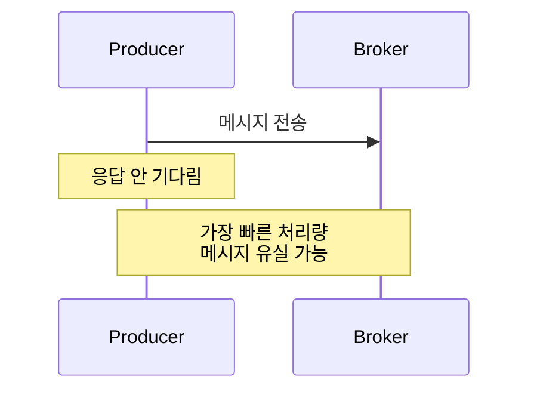
```mermaid
sequenceDiagram
    participant P as Producer
    participant B as Broker

    P->>B: 메시지 전송
    Note over P: 응답 안 기다림
    Note over P,B: 가장 빠른 처리량<br/>메시지 유실 가능
```

- 사용: 실시간 로그, 클릭스트림

**acks=1 (Leader Acknowledgment)**

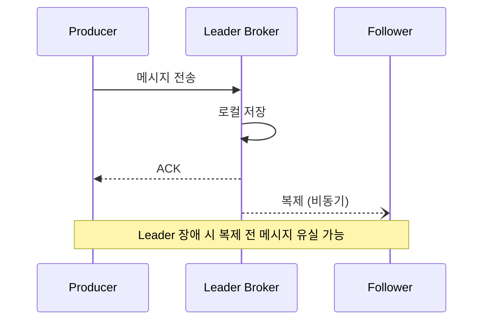
```mermaid
sequenceDiagram
    participant P as Producer
    participant L as Leader Broker
    participant F as Follower

    P->>L: 메시지 전송
    L->>L: 로컬 저장
    L-->>P: ACK
    L--)F: 복제 (비동기)
    Note over P,F: Leader 장애 시 복제 전 메시지 유실 가능
```

- 사용: 일반적인 이벤트 처리

**acks=all (Full Acknowledgment)**

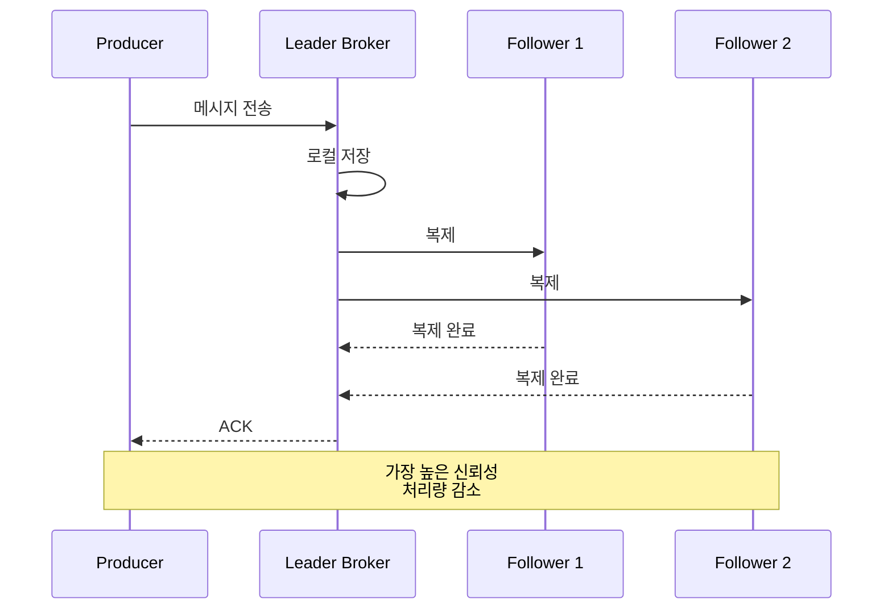
```mermaid
sequenceDiagram
    participant P as Producer
    participant L as Leader Broker
    participant F1 as Follower 1
    participant F2 as Follower 2

    P->>L: 메시지 전송
    L->>L: 로컬 저장
    L->>F1: 복제
    L->>F2: 복제
    F1-->>L: 복제 완료
    F2-->>L: 복제 완료
    L-->>P: ACK
    Note over P,F2: 가장 높은 신뢰성<br/>처리량 감소
```

- 사용: 결제, 주문 등 중요 데이터
- 함께 설정 권장: `min.insync.replicas=2` (최소 2개 복제본에 기록되어야 ACK)

#### 복제(Replication)와 장애 복구

Kafka는 데이터 유실을 방지하기 위해 Partition을 여러 Broker에 복제합니다.

**Leader와 Follower 개념**

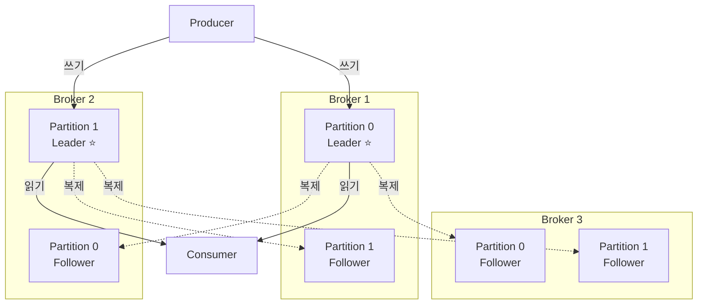
```mermaid
flowchart TB
    subgraph Broker1[Broker 1]
        P0L[Partition 0<br/>Leader ⭐]
        P1F[Partition 1<br/>Follower]
    end

    subgraph Broker2[Broker 2]
        P0F1[Partition 0<br/>Follower]
        P1L[Partition 1<br/>Leader ⭐]
    end

    subgraph Broker3[Broker 3]
        P0F2[Partition 0<br/>Follower]
        P1F2[Partition 1<br/>Follower]
    end

    P0L -.->|복제| P0F1
    P0L -.->|복제| P0F2
    P1L -.->|복제| P1F
    P1L -.->|복제| P1F2

    Producer -->|쓰기| P0L
    Producer -->|쓰기| P1L
    P0L -->|읽기| Consumer
    P1L -->|읽기| Consumer
```

| 용어 | 설명 |
|------|------|
| **Leader** | Producer/Consumer가 실제로 읽고 쓰는 파티션 |
| **Follower** | Leader의 데이터를 복제하여 동기화하는 파티션 |
| **ISR (In-Sync Replicas)** | Leader와 동기화가 완료된 Replica 목록 |
| **Replication Factor** | 복제본 개수 (예: 3이면 Leader 1개 + Follower 2개) |

**정상 상태에서의 복제 과정**

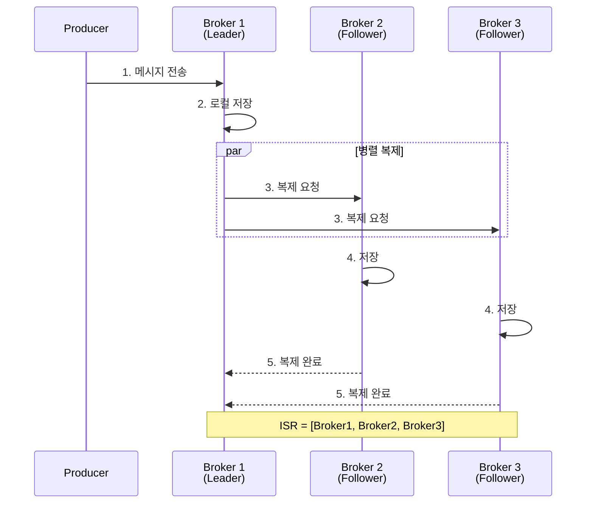
```mermaid
sequenceDiagram
    participant P as Producer
    participant L as Broker 1<br/>(Leader)
    participant F1 as Broker 2<br/>(Follower)
    participant F2 as Broker 3<br/>(Follower)

    P->>L: 1. 메시지 전송
    L->>L: 2. 로컬 저장

    par 병렬 복제
        L->>F1: 3. 복제 요청
        L->>F2: 3. 복제 요청
    end

    F1->>F1: 4. 저장
    F2->>F2: 4. 저장
    F1-->>L: 5. 복제 완료
    F2-->>L: 5. 복제 완료

    Note over L,F2: ISR = [Broker1, Broker2, Broker3]
```

**Leader 장애 발생 시 복구 과정**

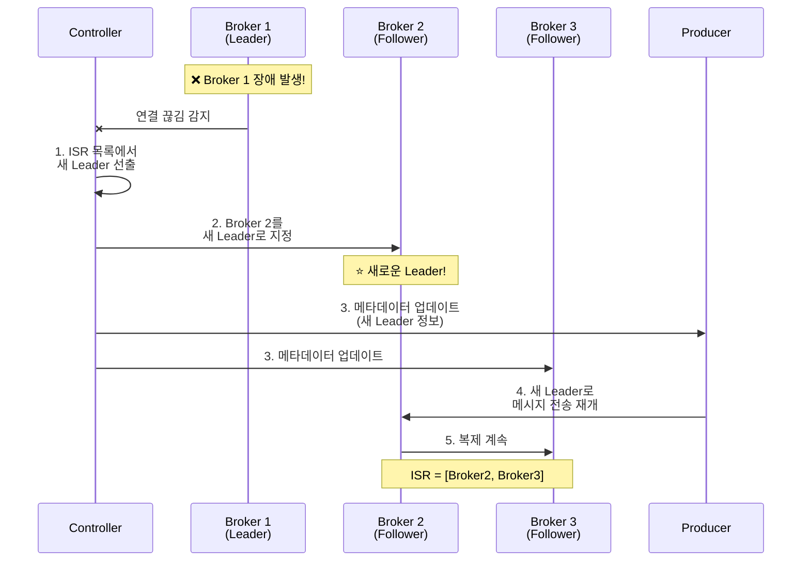
```mermaid
sequenceDiagram
    participant C as Controller
    participant L as Broker 1<br/>(Leader)
    participant F1 as Broker 2<br/>(Follower)
    participant F2 as Broker 3<br/>(Follower)
    participant P as Producer

    Note over L: ❌ Broker 1 장애 발생!

    L-xC: 연결 끊김 감지

    C->>C: 1. ISR 목록에서<br/>새 Leader 선출
    C->>F1: 2. Broker 2를<br/>새 Leader로 지정

    Note over F1: ⭐ 새로운 Leader!

    C->>P: 3. 메타데이터 업데이트<br/>(새 Leader 정보)
    C->>F2: 3. 메타데이터 업데이트

    P->>F1: 4. 새 Leader로<br/>메시지 전송 재개
    F1->>F2: 5. 복제 계속

    Note over F1,F2: ISR = [Broker2, Broker3]
```

**복구 과정 요약**

1. **장애 감지**: Controller가 Leader Broker와의 연결 끊김 감지 (heartbeat 실패)
2. **Leader 선출**: ISR 목록에서 동기화가 완료된 Follower 중 하나를 새 Leader로 선출
3. **메타데이터 전파**: 모든 Broker와 클라이언트에게 새 Leader 정보 전달
4. **서비스 재개**: Producer/Consumer가 새 Leader로 연결하여 작업 재개
5. **복구된 Broker 재참여**: 장애가 복구된 Broker는 Follower로 재참여하여 동기화

**장애 복구 시간**

| 모드 | 복구 시간 | 설명 |
|------|-----------|------|
| Zookeeper 모드 | 수십 초 ~ 수 분 | Zookeeper 세션 타임아웃 + Controller 선출 |
| KRaft 모드 | 수 초 이내 | Raft 프로토콜로 빠른 Leader 선출 |

**데이터 유실 방지를 위한 권장 설정**

```properties
# Topic 설정
replication.factor=3          # 복제본 3개 (Leader 1 + Follower 2)
min.insync.replicas=2         # 최소 2개 복제본에 기록되어야 성공

# Producer 설정
acks=all                      # 모든 ISR에 복제 완료 후 ACK
retries=3                     # 실패 시 재시도
```

> **참고**: `min.insync.replicas=2` + `acks=all` 조합을 사용하면, Leader와 최소 1개의 Follower에 데이터가 기록되어야 성공으로 처리됩니다. 이 경우 Leader 장애 시에도 데이터 유실이 없습니다.

#### 대규모 처리가 가능한 원리

Kafka가 초당 수백만 건의 메시지를 처리할 수 있는 핵심 원리입니다.

**1. 순차 I/O (Sequential I/O)**

```
# 일반적인 DB (Random I/O)
디스크 헤드 이동 → 읽기 → 이동 → 쓰기 → 이동...
                 (느림)

# Kafka (Sequential I/O)
연속된 블록에 순차 기록 → 읽기도 순차적
[msg1][msg2][msg3][msg4][msg5]...
                 (HDD에서도 빠름)

- 랜덤 I/O 대비 수백 배 빠른 성능
- SSD가 아닌 HDD에서도 높은 처리량
```

**2. Zero-Copy 전송**

```
# 일반적인 데이터 전송
디스크 → 커널 버퍼 → 애플리케이션 버퍼 → 소켓 버퍼 → NIC
         (4번의 복사, 컨텍스트 스위칭)

# Kafka Zero-Copy (sendfile 시스템 콜)
디스크 → 커널 버퍼 ─────────────────────→ NIC
         (복사 없이 직접 전송)

- CPU 사용량 감소
- 메모리 대역폭 절약
```

**3. 페이지 캐시 활용**

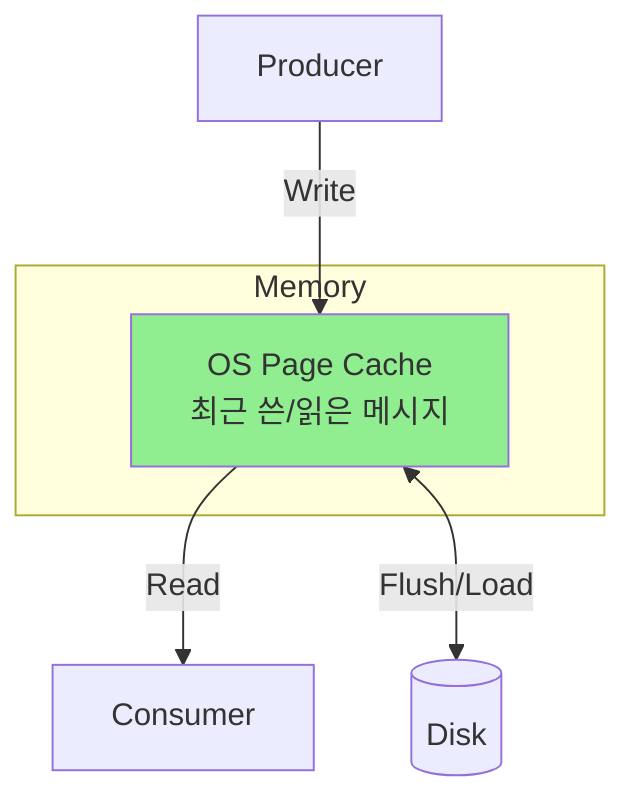
```mermaid
flowchart TB
    subgraph Memory
        PC[OS Page Cache<br/>최근 쓴/읽은 메시지]
    end

    P[Producer] -->|Write| PC
    PC -->|Read| C[Consumer]
    PC <-->|Flush/Load| D[(Disk)]

    style PC fill:#90EE90
```

- Kafka는 JVM 힙 대신 OS 페이지 캐시 활용
- Consumer가 최신 메시지를 읽으면 디스크 접근 없이 캐시에서 제공
- GC 오버헤드 최소화

**4. 배치 처리 (Batching)**

```
# 메시지를 개별 전송하면
[msg1] → 네트워크 → Broker
[msg2] → 네트워크 → Broker
[msg3] → 네트워크 → Broker
         (오버헤드 큼)

# 배치로 묶어서 전송
[msg1, msg2, msg3, ... msg100] → 네트워크 → Broker
                                (한 번의 네트워크 왕복)

# Producer 설정
batch.size=16384        # 배치 최대 크기 (bytes)
linger.ms=5             # 배치 대기 시간 (ms)
```

**5. 파티셔닝을 통한 병렬 처리**

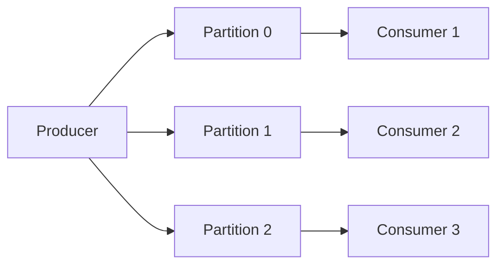
```mermaid
flowchart LR
    P[Producer] --> P0[Partition 0]
    P --> P1[Partition 1]
    P --> P2[Partition 2]

    P0 --> C1[Consumer 1]
    P1 --> C2[Consumer 2]
    P2 --> C3[Consumer 3]
```

- 파티션 수 = 병렬 처리 단위
- 파티션 추가로 처리량 선형 증가
- 각 파티션은 서로 다른 Broker에 분산

**6. 압축 (Compression)**

```
# 압축 설정
compression.type=lz4  # none, gzip, snappy, lz4, zstd

원본 메시지: 1000 bytes × 100개 = 100KB
압축 후:    약 20KB (80% 절약)

- 네트워크 대역폭 절약
- 디스크 저장 공간 절약
- lz4, zstd 권장 (빠른 압축/해제)
```

### Zookeeper vs KRaft

Kafka의 클러스터 메타데이터를 관리하는 방식이 Zookeeper에서 KRaft로 전환되고 있습니다.

#### Zookeeper 모드 (기존 방식)

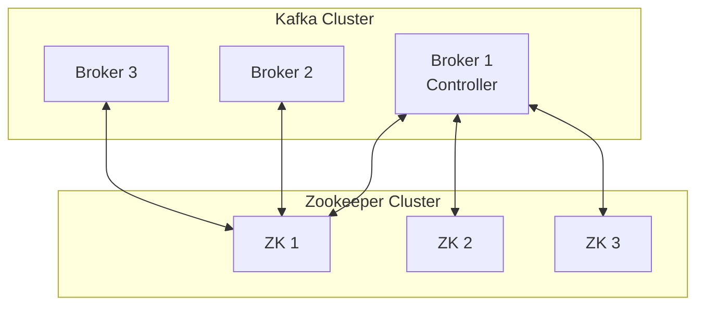
```mermaid
flowchart TB
    subgraph Zookeeper Cluster
        ZK1[ZK 1]
        ZK2[ZK 2]
        ZK3[ZK 3]
    end

    subgraph Kafka Cluster
        B1[Broker 1<br/>Controller]
        B2[Broker 2]
        B3[Broker 3]
    end

    B1 <--> ZK1
    B1 <--> ZK2
    B1 <--> ZK3
    B2 <--> ZK1
    B3 <--> ZK1
```

**관리 항목:**
- 브로커 등록/해제
- 토픽/파티션 메타데이터
- Controller 선출
- ACL (접근 제어)

**Zookeeper의 한계**:
- 별도 클러스터 운영 필요 (운영 복잡도 증가)
- 메타데이터 변경 시 Zookeeper와 Broker 간 동기화 지연
- 대규모 클러스터에서 Controller 장애 복구 시간 증가
- 파티션 수 증가 시 성능 저하

#### KRaft 모드 (Kafka 3.x+)

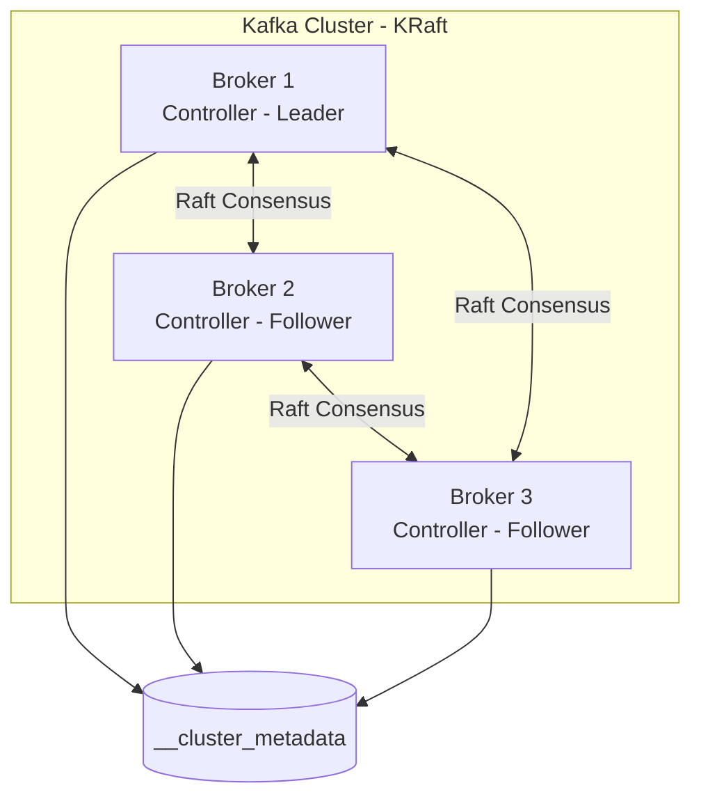
```mermaid
flowchart TB
    subgraph Kafka Cluster - KRaft
        B1[Broker 1<br/>Controller - Leader]
        B2[Broker 2<br/>Controller - Follower]
        B3[Broker 3<br/>Controller - Follower]

        B1 <-->|Raft Consensus| B2
        B2 <-->|Raft Consensus| B3
        B3 <-->|Raft Consensus| B1
    end

    META[(__cluster_metadata)]
    B1 --> META
    B2 --> META
    B3 --> META
```

- Zookeeper 없이 Kafka만으로 클러스터 운영
- Controller가 Raft 프로토콜로 메타데이터 관리
- 메타데이터가 내부 토픽(__cluster_metadata)에 저장

**Zookeeper vs KRaft 비교**

| 항목 | Zookeeper 모드 | KRaft 모드 |
|------|----------------|------------|
| **아키텍처** | Kafka + Zookeeper 분리 | Kafka 단일 시스템 |
| **운영 복잡도** | 높음 (두 시스템 관리) | **낮음** (단일 시스템) |
| **메타데이터 저장** | Zookeeper ZNode | Kafka 내부 토픽 |
| **Controller 선출** | Zookeeper 의존 | Raft 프로토콜 |
| **장애 복구 시간** | 수 분 소요 가능 | **수 초 내 복구** |
| **파티션 확장성** | ~200,000 파티션 | **수백만 파티션** |
| **지원 버전** | Kafka 전 버전 | Kafka 3.0+ |
| **프로덕션 준비** | 안정적 | Kafka 3.3+부터 권장 |

**버전별 권장 사항**

```
Kafka 2.x 이하  → Zookeeper 모드 (유일한 선택)
Kafka 3.0~3.2   → Zookeeper 모드 (KRaft는 실험적)
Kafka 3.3~3.5   → KRaft 모드 권장 (프로덕션 준비 완료)
Kafka 4.0+      → KRaft 모드만 지원 (Zookeeper 제거 예정)
```

**KRaft 설정 예시**

```properties
# server.properties (KRaft 모드)
process.roles=broker,controller
node.id=1
controller.quorum.voters=1@localhost:9093,2@localhost:9094,3@localhost:9095
listeners=PLAINTEXT://localhost:9092,CONTROLLER://localhost:9093
controller.listener.names=CONTROLLER
```

---

## 5. Kafka의 핵심 기능

### 5.1 메시지 발행/구독 (Pub/Sub)

```kotlin
// Producer 예시
@Service
class OrderEventProducer(
    private val kafkaTemplate: KafkaTemplate<String, OrderEvent>
) {
    fun publishOrderCreated(order: Order) {
        val event = OrderEvent(
            eventType = "ORDER_CREATED",
            orderId = order.id,
            userId = order.userId
        )
        kafkaTemplate.send("orders", order.id, event)
    }
}

// Consumer 예시
@Service
class OrderEventConsumer {
    @KafkaListener(topics = ["orders"], groupId = "payment-service")
    fun handleOrderEvent(event: OrderEvent) {
        when (event.eventType) {
            "ORDER_CREATED" -> processPayment(event)
        }
    }
}
```

### 5.2 파티셔닝과 병렬 처리

- 같은 Key를 가진 메시지는 **같은 파티션**으로 전송
- 주문 ID를 Key로 사용하면 같은 주문의 이벤트가 순서대로 처리됨
- 파티션 수 = 최대 Consumer 수 (병렬 처리 단위)

### 5.3 Consumer Group

```mermaid
flowchart TB
    subgraph Topic: orders
        P0[Partition 0]
        P1[Partition 1]
        P2[Partition 2]
    end

    subgraph Consumer Group A - 결제 서비스
        CA1[Consumer 1]
        CA2[Consumer 2]
        CA3[Consumer 3]
    end

    subgraph Consumer Group B - 알림 서비스
        CB1[Consumer 1]
        CB2[Consumer 2]
    end

    P0 --> CA1
    P1 --> CA2
    P2 --> CA3

    P0 --> CB1
    P1 --> CB1
    P2 --> CB2
```

- 같은 Group 내 Consumer들은 파티션을 **분배**받음
- 다른 Group은 **독립적으로** 모든 메시지를 소비

### 5.4 메시지 보존 및 재처리

```properties
# 7일간 메시지 보존
log.retention.hours=168

# 또는 용량 기반 보존
log.retention.bytes=1073741824
```

- 메시지가 소비되어도 **삭제되지 않음**
- Consumer는 offset을 조정하여 **과거 메시지 재처리** 가능

### 5.5 정확히 한 번 전달 (Exactly-Once Semantics)

Kafka 0.11부터 **트랜잭션**을 지원하여 정확히 한 번 전달 보장:

```kotlin
@Transactional
fun processOrder(order: Order) {
    // 1. DB 저장
    orderRepository.save(order)

    // 2. 이벤트 발행 (트랜잭션으로 묶임)
    kafkaTemplate.executeInTransaction { template ->
        template.send("orders", order.id, OrderCreatedEvent(order))
    }
}
```

---

## 6. 언제 Kafka를 사용해야 할까?

### Kafka가 적합한 경우

```
✅ 대용량 실시간 데이터 스트리밍 (로그, 이벤트, 메트릭)
✅ 이벤트 소싱 / CQRS 아키텍처
✅ 메시지 재처리가 필요한 경우
✅ 여러 Consumer가 같은 메시지를 독립적으로 소비
✅ 장기간 메시지 보존이 필요한 경우
✅ 높은 처리량이 필요한 경우 (초당 10만 건 이상)
✅ 마이크로서비스 간 비동기 통신
✅ 실시간 데이터 동기화
```

**적합한 시나리오**:
- 실시간 로그 수집 및 분석 파이프라인
- 마이크로서비스 간 이벤트 기반 통신
- 실시간 추천/개인화 시스템
- IoT 센서 데이터 수집
- CDC(Change Data Capture) 파이프라인

### Kafka가 적합하지 않은 경우

```
❌ 단순한 요청-응답 패턴 (REST API가 더 적합)
❌ 즉각적인 응답이 필요한 경우
❌ 메시지 수가 적고 단순한 시스템
❌ 복잡한 라우팅 로직이 필요한 경우
❌ 우선순위 기반 메시지 처리가 필요한 경우
❌ 운영 인력/인프라가 부족한 경우
```

### 다른 메시지 큐 서비스가 적합한 경우

#### RabbitMQ를 선택해야 하는 경우

```
✅ 복잡한 라우팅 로직이 필요한 경우
✅ 요청-응답 패턴 (RPC)
✅ 우선순위 큐가 필요한 경우
✅ 메시지별 TTL 설정이 필요한 경우
✅ 다양한 프로토콜 지원이 필요한 경우 (AMQP, MQTT)
✅ 낮은 지연 시간이 중요한 경우
```

**적합한 시나리오**: 작업 큐, 알림/이메일 발송, 주문 처리 워크플로우, IoT 디바이스 통신

#### AWS SQS를 선택해야 하는 경우

```
✅ AWS 인프라 사용 중
✅ 운영 부담을 최소화하고 싶은 경우
✅ 간단한 큐 기능만 필요한 경우
✅ 완전한 순서 보장이 필요한 경우 (FIFO)
✅ 예측 가능한 비용 구조가 중요한 경우
✅ 소규모~중규모 트래픽
```

**적합한 시나리오**: 서버리스 아키텍처, 간단한 작업 큐, AWS 서비스 간 통합, 스타트업/소규모 프로젝트

#### Redis Pub/Sub를 선택해야 하는 경우

```
✅ 초저지연이 필요한 경우
✅ 이미 Redis를 사용 중인 경우
✅ 메시지 영속성이 필요 없는 경우
✅ 간단한 실시간 알림
✅ 캐시 무효화 브로드캐스트
```

**적합한 시나리오**: 실시간 채팅/알림, 캐시 무효화 전파, 게임 서버 실시간 통신, 세션 동기화

### 의사결정 플로우차트

```mermaid
flowchart TD
    START[메시지 큐가 필요하다!] --> Q1{처리량이<br/>초당 10만 건 이상?}

    Q1 -->|Yes| KAFKA1[Kafka]
    Q1 -->|No| Q2{메시지 재처리<br/>필요?}

    Q2 -->|Yes| KAFKA2[Kafka]
    Q2 -->|No| Q3{복잡한 라우팅<br/>필요?}

    Q3 -->|Yes| RABBIT1[RabbitMQ]
    Q3 -->|No| Q4{AWS 사용 +<br/>관리 부담 최소화?}

    Q4 -->|Yes| SQS[AWS SQS]
    Q4 -->|No| RABBIT2[RabbitMQ]

    style KAFKA1 fill:#FF6B6B
    style KAFKA2 fill:#FF6B6B
    style RABBIT1 fill:#4ECDC4
    style RABBIT2 fill:#4ECDC4
    style SQS fill:#FFE66D
```

---

## 7. 정리

| 항목 | 핵심 내용 |
|------|-----------|
| **정의** | 분산 이벤트 스트리밍 플랫폼 |
| **핵심 가치** | 높은 처리량, 확장성, 내구성 |
| **주요 개념** | Topic, Partition, Offset, Consumer Group |
| **아키텍처** | 이벤트 기반, 느슨한 결합, 비동기 처리 |
| **활용** | 마이크로서비스 통신, 실시간 파이프라인 |

---

## 참고 자료

- [Apache Kafka 공식 문서](https://kafka.apache.org/documentation/)
- [Kafka: The Definitive Guide](https://www.confluent.io/resources/kafka-the-definitive-guide/)
- [Spring for Apache Kafka](https://spring.io/projects/spring-kafka)
