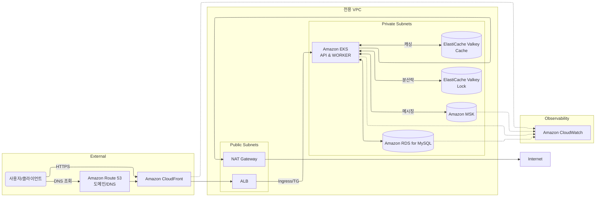

# 인프라 구성도 (EKS)

API, 주문완료 컨슈머, MSK, RDS, Valkey, CDN, ALB, NAT, 고가용/확장성을 Kubernetes(EKS)로 구현한 아키텍처입니다.

## 아키텍처 개요 (Mermaid)

참고: ALB는 AWS Load Balancer Controller에 의해 Ingress로 매핑되며, Listener Rule/Target Group(targetType=ip)을 통해 EKS로 트래픽이 전달됩니다.

## 구성 요소
- DNS/도메인: Amazon Route 53 (A/AAAA -> CloudFront)
- CDN: Amazon CloudFront
  - API 캐시: Cache-Control, 캐시 키(쿼리/헤더) 구성, 짧은 TTL + Invalidation 활용
- Ingress/로드밸런서: AWS Load Balancer Controller + Ingress (ALB + Target Group)
  - IngressClass=alb, targetType=ip 권장
- 컴퓨팅: Amazon EKS (API/Consumer 워크로드)
- 캐시: ElastiCache for Valkey (Cache), 분산락: ElastiCache for Valkey (Lock)
- 메시징: Amazon MSK (Kafka)
- 데이터베이스: Amazon RDS for MySQL (Multi-AZ)
- 네트워크: 전용 VPC, 퍼블릭/프라이빗 서브넷, NAT 게이트웨이(아웃바운드)
- 관찰성: Amazon CloudWatch

## 트래픽 흐름(요약)
1) Client -> Route 53 -> CloudFront -> ALB -> Ingress/TG -> EKS(API)
2) EKS(API): 필요 시 Lock 획득(Valkey-Lock) -> Cache 조회/미스 시 RDS 조회 -> 응답/캐시(Valkey-Cache)
3) 주문 완료: EKS(API) -> MSK 생산, EKS(Consumer) <- MSK 소비
4) 아웃바운드: EKS -> NAT -> Internet

## 확장/가용성/보안(요약)
- HPA/Cluster Autoscaler, RDS Multi-AZ, ElastiCache Replica, MSK 다중 AZ
- SG 최소권한, IRSA, 전송구간/정지 시 암호화, WAF(선택)
- 모니터링: CloudWatch 지표/로그, 알람
